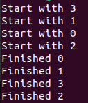
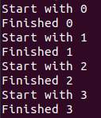
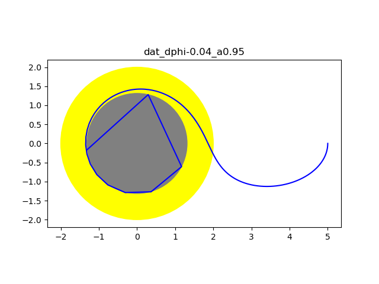

Dieses Programm berechnet die Trajektorie eines Probekörpers um ein rotierendes schwarzes Loch mit Einsatz der parallelen Programmierung (mit openmp [openmp](https://www.openmp.org/)) d.h. auf mehreren Kernen gleichzeitig. Dazu werden die Geodätengleichungen in der Kerr-Metrik und den Boyer-Lindquist Koordinaten gelöst. Der spezifische Drehimpuls a gibt die Stärke der Drehung an und nimmt Werte zwischen -1 und 1 an. Ist der spezifische Drehimpuls a = 0, rotiert das schwarze Loch nicht.
Als numerisches Lösungsverfahren wird das (explizite) Runge Verfahren vierter Ordnung eingesetzt.

## Kompilieren und Ausführen des Quellcodes
Das Programm wurde auf einem Ubuntu-Rechner mit der Ubuntu Version 22.04 entwickelt und getestet.
Soll parallele Programmierung verwendet werden, muss der Quellcode mit der Option fopenmp kompiliert werden:

g++ -fopenmp main.cpp solver.cpp

Anschließend kann das Programm mit

./a.out  

gestartet werden. Der Quellcode befindet sich im Ordner SourceCode. Ob parallel gerechnet wurde, lässt sich an der Ausgabe erkennen. Im 1. Bild wurde parallel gerechnet: die verschiedenen Aufgaben beginnen, bevor die erste Aufgabe abgeschlossen wurde.

Im 2. Bild wurde nicht parallel gearbeitet, da die einzelnen Aufgaben nacheinander abgearbeitet wurden.

Nachdem der Code ausgeführt wurde, finden sich in dem Ordner des kompilierten und ausgeführten Programms Dateien, die die Trajektorie beinhalten. Mit den mitgelieferten Python Programmen, werden die Dateien eingelesen und Bilddateien erstellt, die die Trajektorie visualisieren, siehe folgende Abbildung. Der Plot der Trajektorie, kann mit dem Aufruf

python3 plot2.py <dateiname_mit_Daten.txt> <Wert_des_Rotationsparameters_a>

erstellt werden. Das folgende Bild wurde mit dem Aufruf

python3 plot2.py dat_dphi-0.04_a0.95 0.95

erstellt. Es zeigt die Trajektorie des Probekörpers um ein rotierendes schwarzes Loch.

(Bemerkung: Zur Übersichtlichkeit wurden die Dateien hier auf Github in seperate Ordner verschoben. Bei der Erzeugung der Bilder befanden sich die Inhalte der Ordner results und SourceCode in einem gemeinsamen Ordner.)

Der gelbe Bereich ist die Ergospäre und der graue Bereich ist der Ereignishorizont. Innherhalb des Ereignishorizonts ist der Raum so stark gekrümmt, dass nicht einmal Licht diesen Bereich verlassen kann. Bemerkung: Das Teilchen fliegt nicht durch den Ereignishorizont. An dieser Stelle ist die Schrittweite zu groß und nur die geplottete Verbindungslinie zwischen zwei aufeinander folgenden Punkten der Trajektorie geht durch den Ereignishorizont.
Wir erkennen, dass das Teilchen in eine Richtung entgegen der Drehrichtung startet, dann außerhalb des gelben Bereichs die Richtung umkehrt und in Drehrichtung in den gelben Bereich eintaucht.

Weitere Ergebnisbilder befinden sich im Ordner results.

### Erklärung
Der Grund für die Richtungsumkehr ist der Frame-Dragging-Effekt. Dieser Effekt kann anhand eines alltäglichen Beispiels veranschaulicht werden: Fließt das Wasser aus der Badewanne, entsteht ein Strudel. Allerdings bewegt sich nicht nur das Wasser im Strudel, sondern auch außerhalb des Strudels. Bei einem rotierenden schwarzen Loch passiert etwas ähnliches. Hier bewegt sich die Raumzeit um das schwarze Loch in dessen Drehrichtung. In der sogenannten Ergosphäre (dem gelben Bereich) kann sich kein Teilchen entgegen der Drehrichtung des schwarzen Lochs bewegen (weil es sich dafür schneller als mit Lichtgeschwindigkeit bewegen müsste). Analog zu einem (sehr kleinen) Boot in dem Strudel in der Badewanne wird das Teilchen in Rotationsrichtung gezogen. Das Boot kann nur dann entgegengesetzt der Drehrichtung des Studels fahren, wenn seine Geschwindigkeit groß genug ist. Rotiert das Wasser schneller als die Maximalgeschwindigkeit des Bootes, wird das Boot in Drehrichtung mitgezogen. Innerhalb der Ergospäre reicht die Lichtgeschwindigkeit nicht mehr aus um sich entgegen der Drehrichtung des schwarzen Lochs zu bewegen.

Copyright (C) 2024 Michael
